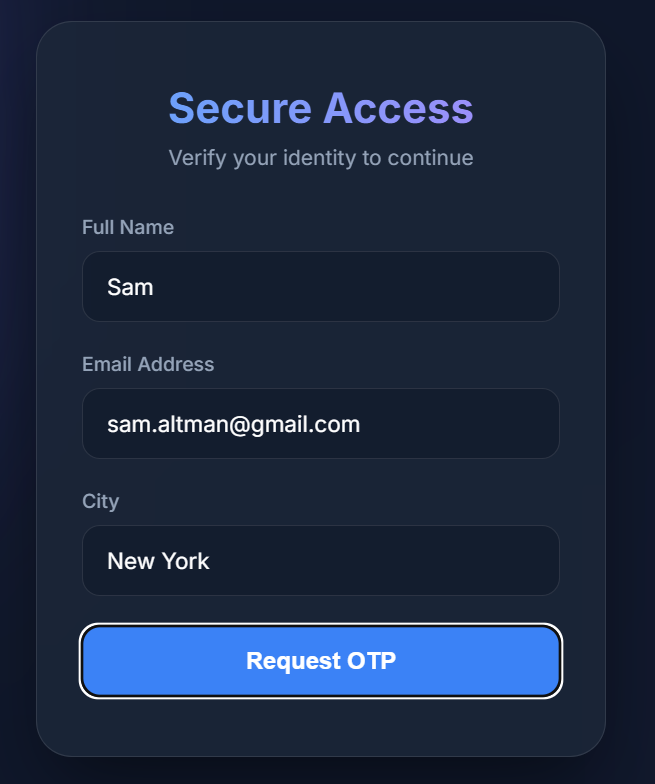
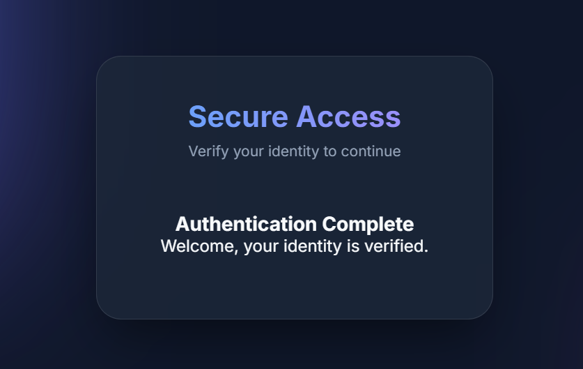
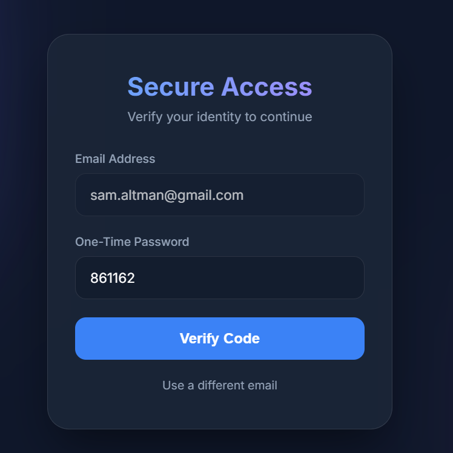

# OTP Validator using Serverless

## Project Overview

The **OTP Validator** is a serverless application built on AWS that provides secure, multi-factor authentication through One-Time Passwords (OTP). This project demonstrates a complete end-to-end solution combining AWS Lambda, API Gateway, DynamoDB, and SES for user email verification.

The system generates secure OTPs, stores hashed values in DynamoDB with automatic expiration, and provides a responsive frontend for seamless user experience.

---

## Architecture Diagram


---

## Project Walkthrough

### How It Works

1. **User enters their email address** on the frontend
2. **Request OTP**: `POST /otp/request` endpoint:
   - Generates a secure, random 6-digit OTP
   - Stores only the HMAC hash in DynamoDB (never plaintext)
   - Sends the OTP via AWS SES to the user's email
   - Sets TTL for automatic expiration
3. **User submits the OTP** they received via email
4. **Verify OTP**: `POST /otp/verify` endpoint:
   - Verifies the OTP against the stored hash
   - Enforces expiry validation server-side
   - Deletes the entry from DynamoDB on success
5. **Success Page**: User is redirected to display **"OTP Verified Successfully"**

---

## System Architecture

### API Gateway

The API Gateway exposes two secure endpoints for OTP operations:

| Endpoint | Method | Purpose |
|----------|--------|---------|
| `/otp/request` | POST | Generate and send OTP to user's email |
| `/otp/verify` | POST | Verify the OTP and authenticate user |

**Request/Verify Flow:**
```
User Frontend → API Gateway → Lambda Functions → DynamoDB / SES
```

### AWS Lambda Functions

#### 1. **requestOtp Lambda Function**
- **File**: `backend/src/requestOtp.py`
- **Purpose**: Generate random OTP and initiate email sending
- **Operations**:
  - Generates a cryptographically secure 6-digit OTP
  - Creates an HMAC hash of the OTP for secure storage
  - Stores entry in DynamoDB with user email, name, city, and hashed OTP
  - Sets TTL (Time To Live) for automatic expiration (default: 10 minutes)
  - Sends OTP to user's email via AWS SES
  - Returns success/error response

#### 2. **verifyOtp Lambda Function**
- **File**: `backend/src/verifyOtp.py`
- **Purpose**: Validate OTP and grant access
- **Operations**:
  - Retrieves stored OTP hash from DynamoDB
  - Validates OTP expiry timestamp server-side
  - Compares submitted OTP with stored hash
  - Deletes verified entry from DynamoDB
  - Returns success/error response with authentication status

#### 3. **OTP Utility Module**
- **File**: `backend/src/otp.py`
- Provides cryptographic functions for OTP generation and verification

### DynamoDB Table

**Table Name**: `otp-table`

**Schema**:
| Attribute | Type | Purpose |
|-----------|------|---------|
| `email` | String (Partition Key) | Unique identifier for user |
| `name` | String | User's full name |
| `city` | String | User's city/location |
| `otp_hash` | String | HMAC hash of the OTP (never plaintext) |
| `timestamp` | Number | Creation time (Unix timestamp) |
| `ttl` | Number | TTL attribute for automatic expiration |

**Security Features**:
- OTP stored as HMAC hash, never in plaintext
- Automatic expiration via TTL mechanism
- Server-side expiry validation
- Email-based access control

---

## Frontend Application

The frontend provides an intuitive, responsive interface for users to:

1. **Request OTP Screen**: Enter email, name, and city
2. **Verify OTP Screen**: Submit OTP received via email
3. **Success Screen**: Confirmation of successful verification

### Frontend Images

**Request OTP Page:**


**Last Request Status:**


**Verification Status:**


### Frontend Files
- `frontend/index.html` - Main HTML structure
- `frontend/script.js` - Request/verify logic and API integration
- `frontend/style.css` - Responsive styling
- `frontend/proxy.py` - Backend proxy for local development
- `frontend/Dockerfile` - Docker containerization for deployment

---

## Deployment Instructions

### Backend (AWS Lambda)

1. Navigate to the backend directory:
   ```bash
   cd backend
   ```

2. Deploy using AWS SAM:
   ```bash
   sam build
   sam deploy --guided
   ```

3. Copy the `OtpApiBaseUrl` from stack outputs

### Frontend (Docker)

1. Build the Docker image:
   ```bash
   cd frontend
   docker build -t otp-frontend:latest .
   ```

2. Run the container:
   ```bash
   docker run -p 8000:8000 otp-frontend:latest
   ```

3. Access at `http://localhost:8000`

---

---

## Technology Stack

- **Backend**: Python, AWS Lambda
- **API**: API Gateway (REST)
- **Database**: DynamoDB
- **Email Service**: AWS SES
- **Frontend**: HTML, JavaScript, CSS
- **Deployment**: Docker, AWS SAM
- **Infrastructure**: Serverless (AWS)

---

## File Structure

```
.
├── README.md                           # Project documentation
├── DEPLOYMENT_GUIDE.md                 # Detailed deployment steps
├── API_USAGE.md                        # API endpoint documentation
├── data/                               # Images and diagrams
│   ├── Blank board.png                # Architecture diagram
│   ├── frontend.png                   # Frontend screenshot
│   ├── last.png                       # Last request screenshot
│   └── otp.png                        # OTP verification screenshot
├── backend/                            # Lambda functions
│   └── src/
│       ├── requestOtp.py              # OTP request logic
│       ├── verifyOtp.py               # OTP verify logic
│       └── otp.py                     # OTP utilities
└── frontend/                           # Web application
    ├── index.html                     # Main page
    ├── script.js                      # Frontend logic
    ├── style.css                      # Styling
    ├── proxy.py                       # Development proxy
    └── Dockerfile                     # Container configuration
```

---

## Notes

- **Security**: OTPs are never stored in plaintext. DynamoDB stores an HMAC hash + timestamps, and TTL auto-expires items.
- **Expiry Enforcement**: `verifyOtp` enforces expiry server-side even though DynamoDB TTL is eventual.
- **Scalability**: Serverless architecture automatically scales with demand.
- **Cost-Efficient**: Pay only for what you use; no idle infrastructure costs.

---

## Next Steps

1. Review the [DEPLOYMENT_GUIDE.md](DEPLOYMENT_GUIDE.md) for detailed setup instructions
2. Check [API_USAGE.md](API_USAGE.md) for API endpoint specifications
3. Deploy to AWS using SAM
4. Test the complete flow with the provided frontend
